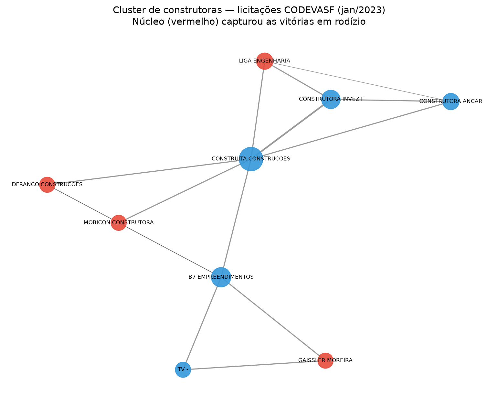

# auditoria-ml

Detecção de anomalias e indícios de fraude em licitações federais brasileiras, combinando **análise forense determinística**, **teoria de grafos** e **machine learning não supervisionado**. Dados públicos do Portal da Transparência (CGU).

> **Princípio norteador:** o objetivo não é "provar fraude", é **priorizar a fila de auditoria**. Cada técnica produz uma lista de casos que um auditor humano abriria primeiro — e boa parte do trabalho é distinguir *anomalia estatística*, *padrão legítimo de mercado* e *suspeita real*.

---

## Dados

- **Fonte:** [Portal da Transparência](https://portaldatransparencia.gov.br/download-de-dados/licitacoes) — licitações, participantes e itens do Poder Executivo Federal.
- **Recorte:** jan/2023 – abr/2024 (regime da Lei 8.666; abril/2024 marca a migração para a Lei 14.133 / PNCP, quando o dataset legado seca).
- **Volume:** ~96 mil licitações, ~4,6 milhões de participações, ~82 mil fornecedores.
- Os CSVs brutos **não** vão para o repositório (pesados). Rode `python -m src.download` para reconstruí-los.

## Como rodar

```bash
git clone https://github.com/gustavogomes-dv/auditoria-ml.git
cd auditoria-ml
python -m venv .venv
source .venv/Scripts/activate      # Windows: .venv\Scripts\activate
pip install -r requirements.txt
python -m src.download             # baixa os dados do Portal da Transparência
```

Depois, execute os notebooks em ordem (`notebooks/01` a `05`).

## Estrutura

```
src/
  download.py   # download automatizado e idempotente dos dados
  carga.py      # consolidação dos CSVs mensais
  benford.py    # teste de Benford + qui-quadrado + MAD por grupo
  grafo.py      # grafo de coparticipação e detecção de comunidades
  limpeza.py    # remoção de placeholders (0, 0.01, 1.00)
notebooks/
  01_exploracao.ipynb
  02_benford.ipynb
  03_benford_por_orgao.ipynb
  04_grafo_participantes.ipynb
  05_ml_anomalias.ipynb
```

---

## Metodologia e achados

### 1. Análise forense (Lei de Benford)

Valores gerados por processos econômicos naturais seguem a Lei de Benford (o dígito 1 aparece ~30% das vezes). Desvios podem indicar valores fabricados ou manipulados.

- Teste global aderente (χ² = 6,4; p = 0,60) — baseline saudável.
- Segmentação **por órgão** com a métrica **MAD** (Nigrini), independente do tamanho da amostra.
- **Descoberta importante:** χ² e p-valor enganam com amostras grandes — Defesa e Educação pareciam desviantes só pelo volume (36k / 23k linhas). O MAD reordenou corretamente.
- **Qualidade de dado:** 12,6% dos registros são placeholders (valor R$ 0/0,01/1,00). O valor R$ 1,00 é vício quase exclusivo do Ministério da Justiça (615 de 631 casos) — convenção de sistema distinta dos demais órgãos.

### 2. Grafo de coparticipação (detecção de conluio)

Empresas = nós; coparticipação em licitações = arestas (peso = nº de encontros). Comunidades detectadas via **Louvain**, refinadas por análise de **rodízio de vitórias**.

Três perfis de coparticipação concentrada, distinguidos por conhecimento de domínio:

| Perfil | Exemplo | Classificação |
|---|---|---|
| Oligopólio legítimo | Farmacêuticas/oncológicos (Roche, Novartis) | Arquivar — concentração estrutural |
| Mercado concorrido | Terceirização/limpeza (38 empresas) | Monitorar — coparticipam mas não capturam vitórias |
| **Suspeita prioritária** | **9 construtoras — licitações CODEVASF** | **Auditar** — grupo fechado, vitórias em rodízio, repartição por lotes |



> **Lição:** o padrão estatístico do cartel (grupo fechado + vitórias distribuídas) é **idêntico** ao de um oligopólio legítimo. A distinção exige contexto setorial — não sai do dado sozinha.

### 3. Machine learning (Isolation Forest por fornecedor)

Perfil comportamental de 38,6 mil fornecedores (taxa de vitória, % dispensa/inexigibilidade, concentração por órgão), normalizado, submetido a Isolation Forest.

- 1ª versão pegava os maiores fornecedores nacionais (volume ≠ suspeita) → corrigido com features **comportamentais** normalizadas.
- Topo do ranking: fabricantes de equipamento científico com ~100% de vitória e alta inexigibilidade — **anomalia legítima** (fornecedor exclusivo).
- **Alvo destacado:** W Engenharia (1.619 licitações, 100% vitória, **100% por dispensa**) — sem justificativa de exclusividade.

**Validação contra o CEIS** (cadastro de empresas sancionadas):
- Taxa base de sancionados: 7,5%; nos top 500 anômalos: 0,2%; **lift 0,03x**.
- **Interpretação:** o modelo detecta *dominância de mercado* (players grandes e exclusivos), não *fraude de idoneidade* (empresas-fantasma, laranjas) — que é o que o CEIS registra. O lift baixo **confirma** que os dois medem fenômenos distintos e delimita o escopo do detector.

---

## Principais aprendizados

- Anomalia ≠ fraude. Toda técnica precisa de uma camada de interpretação de domínio para separar dado sujo, padrão legítimo e suspeita real.
- Métricas estatísticas (χ², p-valor) enganam sem controle de tamanho de amostra.
- Validação honesta (mesmo com resultado "negativo") vale mais que um score sem verificação.

## Stack

Python · pandas · numpy · scikit-learn · networkx · scipy · matplotlib

---

*Projeto de portfólio. Os achados são indícios estatísticos para priorização de auditoria, não acusações — nomes de empresas/órgãos derivam de dados públicos e qualquer suspeita exigiria apuração formal.*